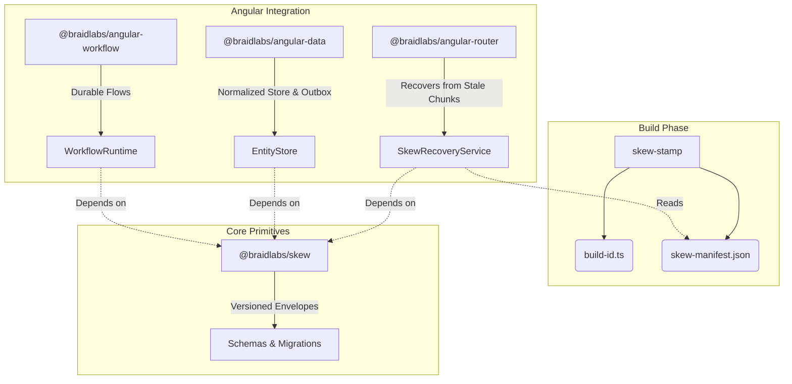
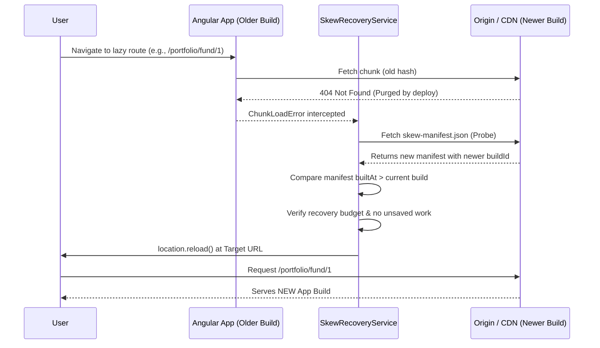
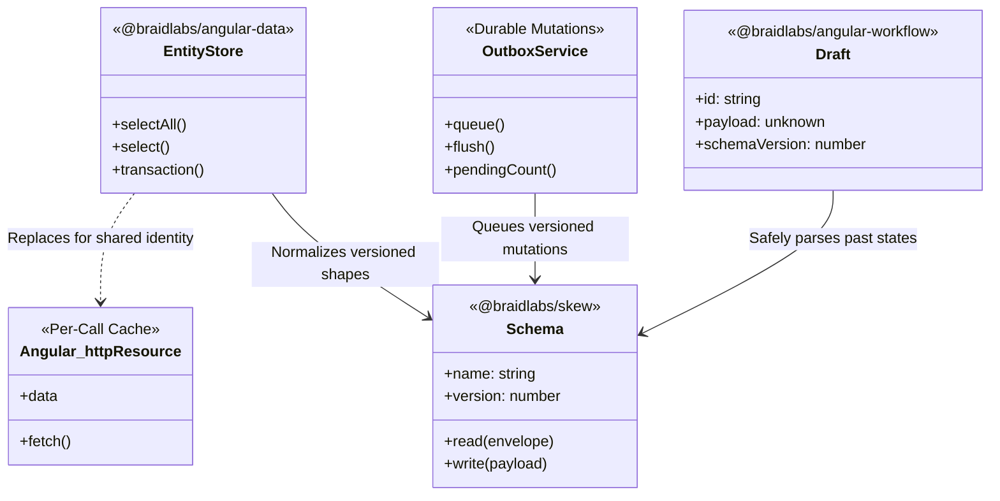

# Braid Architecture Diagrams

This document contains Mermaid diagrams and narratives detailing the overall architecture, deployment recovery sequences, and core entity relationships of the Braid ecosystem.

## 1. Overall Ecosystem Architecture

This diagram illustrates the separation of concerns across the Braid package ecosystem.

**Narrative:**
The Skew ecosystem is explicitly designed so that no Angular package is load-bearing for another; they all independently build upon `@braidlabs/skew`. The core provides the fundamental, framework-agnostic primitives (versioned envelopes and migration chains). The Angular-specific packages (`@braidlabs/angular-router`, `@braidlabs/angular-data`, `@braidlabs/angular-workflow`) leverage these core primitives to solve specific boundary failures: stale lazy chunks, offline mutation syncing, and parked wizard flows. The Build Phase tools (`@braidlabs/build`) provide the necessary timestamp and identity metadata required to make safe, verifiable decisions during runtime version skew events.

---

## 2. Chunk Recovery Sequence

This sequence details what happens when a deploy lands while a user is actively using the application.

**Narrative:**
This sequence diagram captures Braid's signature contribution: surviving a deployment that lands while users are active. When a user requests a lazy-loaded route that has been purged by a recent deployment, Angular natively throws a `ChunkLoadError`. Instead of blindly reloading the current window (which can result in infinite loops on stale edges), `SkewRecoveryService` intercepts the error and pauses to probe the origin for `skew-manifest.json`. By comparing the deployed build timestamp against the running app's memory, Braid safely distinguishes a genuine deployment rollout from transient network errors or deleted routes. It ensures no unsaved work is lost before executing a precise target reload, seamlessly transitioning the user to the newer application build.

---

## 3. Data Entity Relationships

This diagram demonstrates how Braid manages data boundaries, contrasting its approach with standard Angular tools.

**Narrative:**
This entity diagram highlights Braid's structural answer to state and mutation management. Standard Angular primitives like `httpResource()` are excellent for simple reads, but they operate as per-call caches without shared identity or durable write capabilities. `@braidlabs/angular-data` replaces this gap with a normalized `EntityStore` and a durable `OutboxService`. 

Crucially, all of these state containers tie into `@braidlabs/skew`'s `Schema` concept. This ensures that data at rest (such as a parked `Draft` or a queued `OutboxService` mutation) is safely stamped with the `schemaVersion` it was authored under. When a newer build attempts to process an older draft or outbox entry, the `Schema` automatically migrates the payload forward, or fails predictably if the payload was written by a build from the future, preventing silent data corruption.
