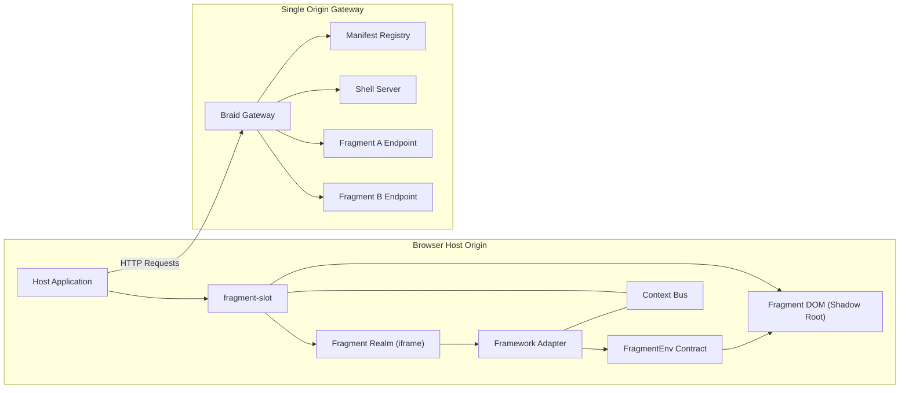
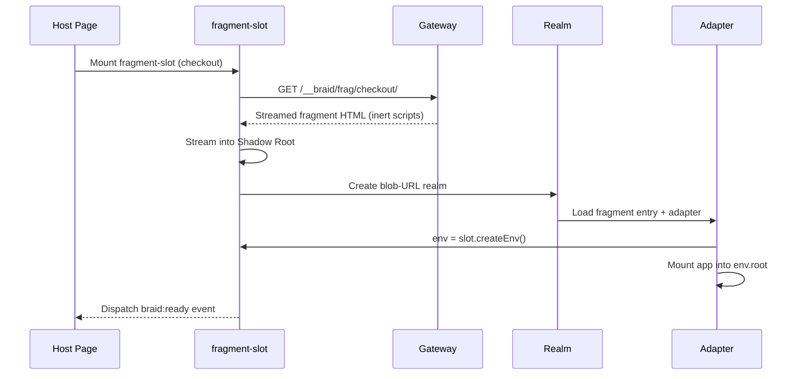
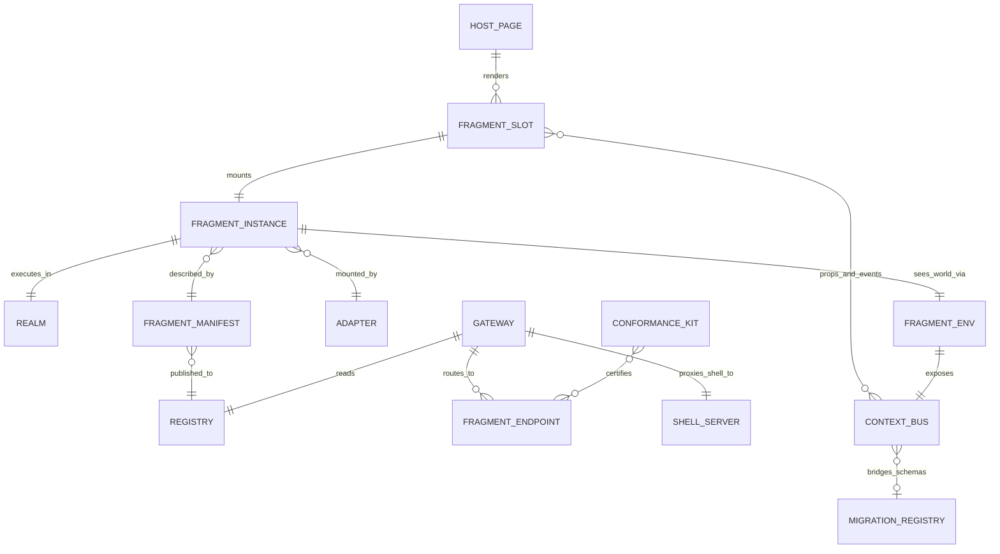
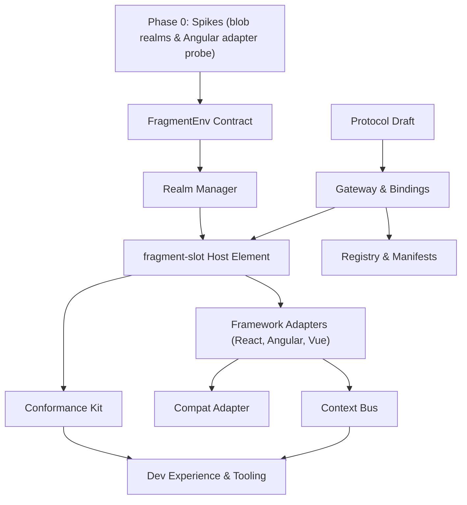

# Braid Architecture

> **New here?** This document assumes the vocabulary — *fragment*, *realm*, *slot*, *piercing*,
> *the `/__braid/` namespace*. [**Braid, explained**](braid-explained.md) introduces all of it from
> scratch, with a walkthrough of one page load, and takes about fifteen minutes. Start there and
> come back.

- **Status:** Draft for review.
- **Name:** **Braid** — independent strands composed into one strong cord, where every strand keeps its own identity and dependencies, while remaining unbraidable (incremental migration is completely reversible).
- **Positioning:** Braid is a **composition layer with skew handling built in**. Its thesis is the elimination of version-skew errors across independently deployed frontend applications. It removes *dependency skew* structurally (isolated JavaScript realms and per-fragment import maps prevent co-deployed apps from colliding) and surfaces *contract skew* at the fragment boundary, where the contract-migration engine in `@braidlabs/skew` bridges version differences over the context bus.
- **Provenance:** Successor concept to [web-fragments](https://github.com/web-fragments/web-fragments) (MIT, Cloudflare-sponsored). Key subsystems were rebuilt and matrix-tested in our research forks (document facade, strict host isolation, exact gateway routing), and empirical results from those tests inform the architecture below.

---

## 1. The Core Concept

Modern organizations want independent teams to ship frontend applications on their own release schedules. At runtime, these applications need to compose into a single cohesive page — sharing one origin, one DOM, and one unified accessibility tree — while each application maintains its own JavaScript runtime context, its own dependencies, and its own release train. This enables legacy monoliths to be modernized incrementally, one page section at a time.

Braid builds upon two foundational techniques:

1. **Splitting the JS Execution Context from the Rendered DOM:** Fragment code runs inside its own isolated realm (a hidden same-origin iframe), while its visual DOM is rendered directly into the host page within a Shadow Root. This provides the isolation benefits of iframes without the typical drawbacks (such as broken layout flow, accessibility fragmentation, and SEO barriers).
2. **The Single-Origin Gateway:** A lightweight server middleware that sits in front of the application shell and microfrontend endpoints. It routes fragment traffic and streams server-rendered fragment HTML directly into the page stream during initial document requests (a process called *piercing*).

### What Braid Changes from Earlier Approaches

Earlier experiments attempted to emulate the entire browser environment so that arbitrary legacy applications could run unmodified. In practice, trying to impersonate every browser API creates an unbounded emulation maintenance challenge. Braid flips this model:

- **Contract-First Architecture:** For modern applications, Braid provides an explicit, lightweight contract (`FragmentEnv`). Framework adapters (for React, Angular, Vue, and Web Components) plug this contract directly into existing framework extension points (like Angular's `DOCUMENT` token or React's `createRoot`).
- **Contained Compatibility Mode:** For legacy applications that cannot be modified, Braid provides a dedicated **Compat Adapter**. This isolates the DOM emulation and monkey-patching strictly within the fragment's own realm, keeping the host page 100% pristine.

### How Braid handles skew

Independently deployed frontends naturally introduce version skew: pages compose artifacts built at different times, against different dependency trees, and with different data contracts. Braid handles these two types of skew deliberately:

- **Dependency Skew is Eliminated Structurally:** Realm-per-fragment isolation and independent import maps ensure that conflicting libraries (e.g. React 18 alongside React 19, or zoneless Angular alongside zoned Angular) never share global scope.
- **Contract Skew is Explicitly Typed and Migrated:** Props, custom events, and shared state cross fragment boundaries as versioned schemas. When a fragment expects schema v2 but the host publishes v3, the bidirectional migration engine in `@braidlabs/skew` bridges the gap on the fly across the context bus.

---

## 2. Developer Experience Budgets

To ensure Braid remains practical and maintainable in production, the architecture adheres to concrete developer experience budgets:

| Goal | Target Budget |
| :--- | :--- |
| **Hosting a fragment** | $\le$ 5 lines of code (1 script tag, 1 `<fragment-slot>` element) |
| **Authoring a fragment (modern framework)** | 0 app logic changes + $\le$ 5 lines of adapter setup |
| **Authoring a fragment (legacy app, compat mode)** | 0 code changes (configuration only) |
| **Local development startup** | 1 command (`braid dev`), starts all services in under 30s |
| **Time to first working demo** | Under 10 minutes from `npm create @braidlabs/core` |
| **Actionable error messages** | Every runtime error identifies the fragment, the failure stage, and a clear fix hint |
| **Host page overhead when idle** | Zero — no global patches, listeners, or observers on the host window |
| **Version safety** | Client and gateway package versions stay aligned; mismatches throw descriptive named errors |

---

## 3. System Architecture

### High-Level Component Flow




### Fragment Boot Sequence (Contract Mode)



---

## 4. Key Architectural Decisions

### 1. Contract-First Architecture (with Contained Emulation)

The runtime provides each modern fragment with clean, explicit environment objects — `env.root`, `env.document`, `env.location`, `env.history`, and `env.context`. **Framework adapters** wire these into standard framework extension points (such as Angular's `DOCUMENT` and `PlatformLocation` dependency injection tokens, or React's `createRoot`).

For legacy applications that cannot be altered during a migration, the **Compat Adapter** provides full browser emulation, strictly sandboxed inside that fragment's realm.

> **Design Considerations & Trade-offs:**
> While providing dedicated framework adapters requires maintaining small integration packages for React, Angular, and Vue, these adapters build upon stable, officially documented framework APIs. This avoids having to emulate hundreds of undocumented browser DOM properties globally. For legacy apps, the compat adapter retains zero-touch integration as an explicit, contained migration tool.

### 2. Realms as Same-Origin Iframes (Blob-URL Booting)

A hidden, same-origin `iframe` remains the only browser primitive capable of providing a synchronous, DOM-capable secondary JavaScript execution context. Workers force asynchronous communication, and `ShadowRealm` does not expose DOM APIs.

For contract-mode fragments, realms boot instantly from an in-memory `blob:` URL created by the runtime. This eliminates network round trips, avoids creating extraneous session history entries, and allows each fragment to declare its own `<base>` URL and import map.

Compat-mode realms boot from a real URL under the gateway namespace (`/__braid/frag/:id/`), ensuring that standard browser `location` and `history` behaviors remain truthful for legacy code.

### 3. Host Purity as an Invariant

Braid never modifies global variables or prototypes on the host page. Even when running legacy applications in compat mode, prototype modifications and DOM intercepts are restricted entirely to the fragment's own realm and its shadow root subtree. This invariant is enforced in CI via automated host-purity test suites.

### 4. Exact Namespace Routing

All fragment traffic is routed through a dedicated origin namespace: `/__braid/frag/:fragmentId/*`
(the realm stub and document namespaces sit beside it — every path, and who requests it when, is
tabulated in [Braid, explained §4](braid-explained.md#4-the-__braid-urls)). Addressing fragments by exact ID ensures deterministic asset resolution, clean caching, and safe support for nested fragments without relying on fragile header sniffing or ambiguous path heuristics. Route patterns in manifests are used solely as sugar for server-side piercing.

### 5. Data-Driven Manifest Registry

Fragments register with the gateway through structured JSON manifests (loaded from local files in development or via URLs/KV stores in production). Adding or updating a fragment does not require redeploying the gateway.

### 6. Two Trust Tiers

`<fragment-slot>` supports two trust tiers with a consistent component API:
- **Trusted Tier (`trust="trusted"`):** High-performance realm isolation with direct DOM projection into shadow roots.
- **Untrusted Tier (`trust="untrusted"`):** Standard cross-origin sandboxed iframes for untrusted third-party widgets, with progressive enhancement via `credentialless` where supported. **Shipped.** Its DOM stays in its own document — none of the trusted tier's shared-document benefits apply across it. See [Trust tiers](./braid-boundary.md).

### 7. Owned Streaming HTML Rewriter

Braid maintains an owned, spec-compliant streaming HTML rewriter for element renaming, script neutralization (`type="inert"`), and slot piercing. This avoids heavy external WebAssembly dependencies while ensuring deterministic streaming behavior across Node.js, Cloudflare Workers, and Deno runtimes.

---

## 5. Entity Model



| Entity | Description |
| :--- | :--- |
| **Fragment Slot** | The custom HTML element rendered by the host; manages lifecycle, shadow roots, and trust tiers. |
| **Fragment Instance** | A single mounted execution of a fragment. |
| **Realm** | The isolated JavaScript execution context (blob iframe, HTTP iframe, or sandbox). |
| **FragmentEnv** | The contract object graph passed to modern fragments in place of global variables. |
| **Adapter** | Framework-specific bridge mapping `FragmentEnv` into framework mount APIs. |
| **Manifest** | Versioned JSON describing a fragment's endpoint, entry point, adapter, routing, and events. |
| **Registry** | The collection of manifests consulted by the gateway for routing and SSR piercing. |
| **Gateway** | Origin-front middleware handling namespace routing, HTML piercing, and shell proxying. |
| **Context Bus** | Typed channel for props, custom events, and shared state between host and fragments. |
| **Migration Registry** | The contract-migration repository (`@braidlabs/skew`) used to translate versioned context payloads. |
| **Conformance Kit** | Test runner certifying that a fragment behaves consistently standalone and slotted. |

---

## 6. Core Components

### 1. `<fragment-slot>` (Host Runtime)

The host page mounts microfrontends using the custom element `<fragment-slot>`:

```html
<script type="module" src="/__braid/client.js"></script>
<fragment-slot name="checkout" trust="trusted" props='{"cartId":"abc"}'></fragment-slot>
```

```ts
interface FragmentSlotElement extends HTMLElement {
  name: string;                   // Fragment ID registered in the gateway
  trust: 'trusted' | 'untrusted'; // Trust tier (default: 'trusted')
  props: Record<string, unknown>; // Reactive property binding
  readonly state: 'idle' | 'loading' | 'ready' | 'error';
  readonly instance: FragmentInstanceHandle | null;
  reload(): Promise<void>;
}
```

Thin typed wrappers (`@braidlabs/react`, `@braidlabs/angular`, `@braidlabs/vue`) provide idiomatic component bindings with typed props and events for each framework.

### 2. Realm Manager

The Realm Manager creates and manages isolated JavaScript contexts:

```ts
interface RealmManager {
  create(kind: 'contract-blob' | 'compat-http' | 'sandbox', init: RealmInit): Promise<RealmHandle>;
}

interface RealmHandle {
  readonly window: Window;
  evaluate(entryUrl: string): Promise<void>;
  dispose(): void;
}
```

| Realm Kind | URL Scheme | Session History | Typical Use Case |
| :--- | :--- | :--- | :--- |
| **contract-blob** | `blob:` | None | Contract-mode modern fragments |
| **compat-http** | `/__braid/frag/...` | Managed via replaceState | Compat adapter (legacy apps) |
| **sandbox** | Cross-origin URL | Browser-managed | Untrusted third-party fragments |

### 3. `FragmentEnv` (The Contract)

Modern fragments interact with the host and browser through the `FragmentEnv` contract:

```ts
interface FragmentEnv {
  readonly contractVersion: '1.0';
  readonly root: HTMLElement;        // Mount container inside the Shadow Root
  readonly document: EnvDocument;    // Scoped head, title, styles, and activeElement
  readonly location: EnvLocation;    // Logical URL for the fragment
  readonly history: EnvHistory;      // Scoped navigation controls
  readonly context: EnvContext;      // Shared state subscription and retrieval
  readonly props: Readonly<Record<string, unknown>>;
  emit(type: string, detail?: unknown): void; // Dispatches typed events to host
  readonly signal: AbortSignal;      // Signals unmount for automatic cleanup
}
```

### 4. Framework Adapters

Framework adapters are lightweight functions that connect `FragmentEnv` to the framework's native mount APIs:

```ts
// React Fragment Entry Example
import { defineFragment } from '@braidlabs/react';
import { App } from './App';

export default defineFragment(App);
```

```ts
// Angular Fragment Entry Example
import { defineFragment } from '@braidlabs/angular';
import { AppComponent } from './app.component';

export default defineFragment(AppComponent, {
  providers: (env) => [
    { provide: DOCUMENT, useValue: env.document },
    { provide: APP_BASE_HREF, useValue: env.location.basePath },
  ],
});
```

### 5. Compat Adapter (Contained Emulation)

For legacy applications, the Compat Adapter provides a complete browser environment emulation:
- Virtualized `Document` proxy facade.
- Per-node prototype stamping inside the fragment's shadow root.
- Born-inert script neutralization and ordered script execution.
- Sandboxed URL resolution and history synchronization.

All emulation mechanisms are strictly confined to the fragment's realm and shadow DOM.

### 6. Gateway Core

The gateway runs as fetch-native middleware across Node.js, Express, Cloudflare Workers, and Deno:

```ts
import { createGateway } from '@braidlabs/gateway';
import { toNodeMiddleware } from '@braidlabs/gateway/node';

const gateway = createGateway({ registry: './braid.registry.json' });
app.use(toNodeMiddleware(gateway));
```

Key features:
- **Namespace Routing:** Directs subresource requests to fragment origins with prefixes stripped.
- **HTML Piercing:** Concurrently fetches shell and fragment SSR responses, interleaving fragments into declarative shadow roots in the initial HTML stream.
- **Resilience:** Configurable timeouts, error fallbacks (`omit`, `placeholder`, `error-html`), and WebSocket pass-through.

### 7. Manifests & Registry

Each microfrontend exports a `braid.manifest.json`:

```jsonc
{
  "id": "checkout",
  "contractVersion": "1.0",
  "endpoint": "https://checkout.internal.example",
  "entry": "/entry.mjs",
  "adapter": "react",
  "pierce": ["/checkout/*"],
  "events": { "checkout:done": { "detail": "object" } },
  "timeoutMs": 1500,
  "fallback": "placeholder"
}
```

### 8. Context Bus & Schema Migrations

The Context Bus enables structured communication between host and fragments:

```ts
// Host publishes shared context
braidContext.set('locale', 'en-US');

// Fragment consumes shared context
env.context.subscribe('locale', (locale) => updateLocale(locale), { signal: env.signal });
```

When microfrontends are deployed with differing schema versions, Braid's contract migrations automatically translate payloads across versions upon delivery.

---

## 7. Security Considerations

- **Realm Isolation Boundary:** Same-origin realms provide execution and namespace isolation, but share storage and cookies with the host origin. Untrusted code should always use `trust="untrusted"` (cross-origin sandboxed iframes).
- **Script Neutralization:** Server-rendered fragment HTML has its `<script>` tags rewritten to `type="inert"` during piercing, ensuring scripts cannot execute until properly initialized in the realm.
- **CSP Compliance:** Blob realms require `'blob:'` in `frame-src`. The gateway and dev server provide diagnostics when Content Security Policies conflict with fragment execution.
- **Input Sanitization:** Props and context data cross realm boundaries exclusively via structured cloning, avoiding direct object reference leaks or prototype pollution.

---

## 8. Isolation Boundaries

| Boundary Scope | Mechanism | Mode |
| :--- | :--- | :--- |
| **Compat Realm (Window)** | Virtualized observers, constructor checks, and sizing proxies | Compat only |
| **Compat Realm (Document)** | Proxy facade over document prototype | Compat only |
| **Fragment DOM Nodes** | Per-node prototype stamping inside shadow root | Compat only |
| **Fragment Scripts** | Born-inert script neutralization until realm activation | Compat only |
| **Contract Realm** | Standard unpatched JavaScript environment (dev warning for global leaks) | Contract mode |

---

## 9. Build and Delivery Plan



| Phase | Core Deliverables |
| :--- | :--- |
| **Phase 0** | Validate blob-URL realms across Chromium, WebKit, and Firefox; build Angular/React DI mount probes. |
| **Phase 1** | Contract path end-to-end: React and vanilla adapters, core gateway, registry loader, and `braid dev`. |
| **Phase 2** | Compat adapter with full WebIDL audit manifest; Angular and Vue adapters; conformance test kit. |
| **Phase 3** | ~~Untrusted sandbox tier~~ (shipped); Context Bus schema migration integration; per-fragment capability grants; production demo apps. |
