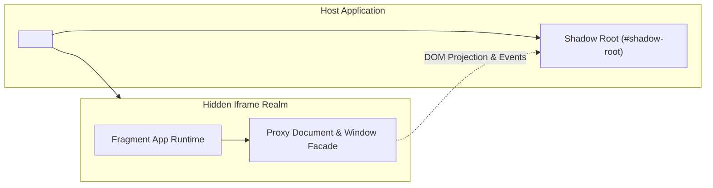

# @braidlabs/core

The foundational Braid client runtime. Compose independently deployed frontend apps into one cohesive page: one origin, one layout, and one accessibility tree, while each application retains its own isolated JavaScript realm, framework version, dependencies, and deployment schedule.

---

## Installation

```bash
npm install @braidlabs/core
```

---

## Key Primitives & Architecture



### 1. The `<fragment-slot>` Element
`<fragment-slot>` is the custom HTML element that marks insertion points in the host page. It handles:
- **Shadow Root Lifecycle:** Creates and manages open Shadow Roots (including Declarative Shadow DOM adoption from SSR piercing).
- **Realm Creation:** Spawns and manages hidden, same-origin iframe execution realms.
- **Dynamic Props & Events:** Translates host properties into the fragment and bubbles fragment events.

### 2. Execution Realms
Braid uses hidden, same-origin iframes as synchronous, DOM-capable JavaScript execution contexts:

| Realm Kind | URL Scheme | Session History Impact | Typical Use Case |
| :--- | :--- | :--- | :--- |
| `compat-http` | `/__braid/frag/:id/…` | Managed via `replaceState` | Legacy applications with zero code changes |
| `contract-blob` | `blob:` | None (Zero history pollution) | Modern contract-mode fragments |
| `sandbox` | Cross-origin URL | Isolated | Untrusted third-party widgets |

### 3. The Compat Adapter
For applications that cannot be altered during a migration, the **Compat Adapter** provides full browser emulation strictly contained inside that fragment's realm:
- **Zero Host Pollution:** Never modifies global variables (`window.*`), DOM prototypes, or listeners on the host page.
- **Document Facade:** Proxies `document.getElementById`, `querySelector`, and DOM insertions directly into the fragment's shadow root.
- **Script Neutralization:** Scripts rendered via SSR are neutralized into `<script type="inert">` so they do not execute on the host, then activated safely inside the realm.

---

## Host Integration API

Initialize Braid in your host application:

```ts
import { initBraid } from '@braidlabs/core';

// Initialize the runtime on the host page
initBraid({
  // Notify fragments on host navigation without patching host History API
  onHostNavigation: (notify) => {
    window.addEventListener('popstate', () => notify());
  },
});
```

Mounting in HTML:

```html
<!-- Mounts the billing fragment -->
<fragment-slot name="billing" trust="trusted"></fragment-slot>
```

---

## Custom Element Adapter

If a fragment publishes a native Web Component / Custom Element, configure it in the manifest without full document emulation:

```json
{
  "id": "star-rating",
  "endpoint": "http://localhost:4503",
  "adapter": "custom-element",
  "entry": "/star-rating.js",
  "element": "star-rating",
  "events": ["rating:change"]
}
```

The custom element upgrades inside the isolated realm and is adopted into the host's Shadow DOM, keeping the host's `customElements` registry unpolluted.

---

## API Reference

### `initBraid(options?: InitBraidOptions): void`
Registers the `<fragment-slot>` custom element and sets up global runtime observers.

```ts
interface InitBraidOptions {
  /** Callback to wire host router navigation events to fragments. */
  onHostNavigation?: (notify: () => void) => void;
  /** Base URL for gateway requests (default: current origin). */
  gatewayBaseUrl?: string;
  /** Global timeout in milliseconds before triggering slot fallbacks. */
  defaultTimeoutMs?: number;
}
```

### `FragmentSlotElement` (`<fragment-slot>`)
DOM Properties and methods on the custom element:

| Property / Method | Type | Description |
| :--- | :--- | :--- |
| `name` | `string` | The fragment ID registered in the gateway manifest. |
| `trust` | `'trusted' \| 'untrusted'` | Trust level (`'trusted'` for realm isolation; `'untrusted'` for sandboxed iframe). |
| `props` | `Record<string, unknown>` | Reactive props passed into the fragment. |
| `state` | `'idle' \| 'loading' \| 'ready' \| 'error'` | Current lifecycle state of the slot. |
| `reload()` | `() => Promise<void>` | Destroys current realm and forces a fresh network fetch & boot. |

### Events Dispatched by `<fragment-slot>`
- `braid:ready`: Dispatched when the fragment has completed booting.
- `braid:error`: Dispatched if fragment fails to fetch or throws during boot.
- `braid:event`: Dispatched when a fragment emits a custom event to the host.
