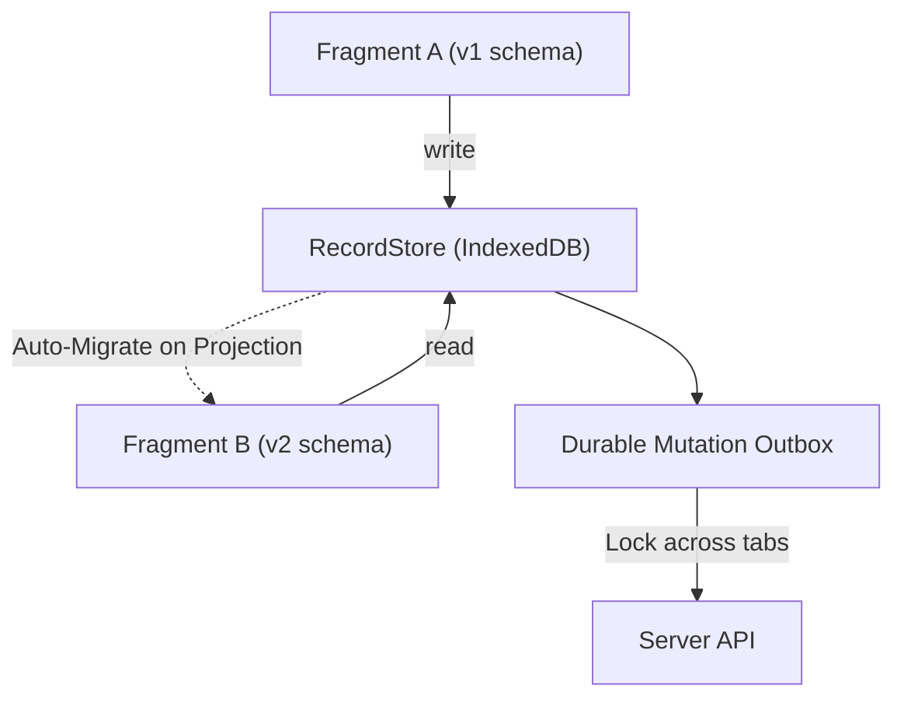

# @braidlabs/data

Framework-neutral, persistence-first client data layer with version-skew tolerance, partition isolation, and cross-realm distributed locks.

IndexedDB is the primary source of truth, and in-memory state is treated as a derived view. Every stored record is wrapped in a `@braidlabs/skew` envelope and projected to the current reader's version on read.

---

## Installation

```bash
npm install @braidlabs/data @braidlabs/skew
```

---

## Key Architecture Concepts



1. **Addressable Record Store:** Avoids read-modify-write races by storing individual addressable records per collection, rather than large monolithic blobs per key.
2. **Tenant & Partition Scoping:** Records are partitioned (e.g. `guest`, `tenant_123`, `user_456`), preventing data leaks across tenant or login boundaries.
3. **Projection on Read:** A record outlives the build that authored it. When read, the record is automatically migrated forward to the reader's declared schema version.
4. **Cross-Context Distributed Locks:** Implements `navigator.locks` across multiple iframe realms and browser tabs with reliable fallback.

---

## Usage

### Creating a Record Store

```ts
import { createRecordStore, indexedDbRecordDriver } from '@braidlabs/data';
import { UserSchema } from './user.schema';

const store = createRecordStore({
  driver: indexedDbRecordDriver({ name: 'my-app-db' }),
  partition: 'tenant_acme',
});

// Writing a versioned record
await store.put('users', 'user_1', UserSchema, {
  id: 'user_1',
  firstName: 'Grace',
  lastName: 'Hopper',
  email: 'grace@navy.mil',
  verified: true,
});

// Reading with automatic schema projection
const user = await store.get('users', 'user_1', UserSchema);
if (user) {
  console.log('Projected user:', user.firstName);
}
```

---

## Cross-Context Distributed Locks

Coordinate actions (such as draining the mutation outbox or flushing cache) across multiple tabs and iframe realms without race conditions:

```ts
import { withLock } from '@braidlabs/data';

await withLock('flush-outbox:tenant_acme', async () => {
  // Only one tab or realm executes this block at a time
  await flushPendingMutations();
});
```

---

## API Reference

### `createRecordStore(options: RecordStoreOptions): RecordStore`

| Method | Signature | Description |
| :--- | :--- | :--- |
| `put` | `(collection, key, schema, value, owner?) => Promise<void>` | Envelopes and stores a versioned record. |
| `get` | `(collection, key, schema) => Promise<T \| null>` | Reads and projects record to target schema version. |
| `delete` | `(collection, key) => Promise<void>` | Removes a record by key. |
| `list` | `(collection, schema) => Promise<T[]>` | Lists all records in the partition, ordered by sequence. |
| `clearPartition` | `(collection) => Promise<void>` | Clears all records for current partition (e.g. on logout). |

### Storage Drivers
- `indexedDbRecordDriver(options: IndexedDbDriverOptions)`: Production persistent IndexedDB driver.
- `memoryRecordDriver()`: In-memory driver for unit testing and ephemeral sessions.
