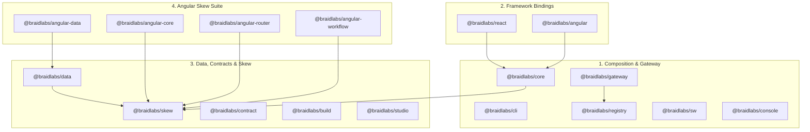

# Braid Packages Reference

Braid is a modular microfrontend and runtime data resilience ecosystem published under the `@braidlabs/*` scope. Each package is independently versioned, rigorously tested, and designed to solve a specific boundary failure in modern composed web applications.

---

## Package Ecosystem Overview

---

## 1. Composition & Gateway Primitives

These packages manage origin routing, streaming HTML composition, declarative shadow DOM projection, and JavaScript realm isolation.

| Package | Description | Key APIs |
| :--- | :--- | :--- |
| [`@braidlabs/core`](./core.md) | Client runtime for mounting fragments in isolated realms and declarative shadow roots. | `<fragment-slot>`, `defineFragment`, `createEnv` |
| [`@braidlabs/gateway`](./gateway.md) | Origin-front middleware for namespace routing, HTML piercing, and streaming SSR composition. | `createGateway`, `toNodeMiddleware` |
| [`@braidlabs/cli`](./cli.md) | Local development server, manifest scaffolding, and multi-origin proxying. | `braid dev`, `braid init` |
| [`@braidlabs/registry`](./registry.md) | Immutable manifest snapshots, content-addressed versioning, and validation. | `createRegistry`, `validateManifest` |
| [`@braidlabs/sw`](./sw.md) | Service Worker partition handler for skew-safe chunk delivery across rolling deploys. | `createBraidFetchHandler`, `braidServiceWorker` |
| [`@braidlabs/console`](./console.md) | Visual registry inspector and gateway status dashboard. | `<BraidConsole>`, `mountConsole` |

---

## 2. Framework Bindings

Typed components and navigation connectors for popular UI frameworks.

| Package | Description | Key APIs |
| :--- | :--- | :--- |
| [`@braidlabs/react`](./react.md) | React component and hooks for mounting and communicating with Braid fragments. | `<BraidFragment>`, `useBraidContext`, `useBraidEvent` |
| [`@braidlabs/angular`](./angular.md) | Angular component and providers for embedding Braid fragments into Angular applications. | `<braid-fragment>`, `provideBraid()` |

---

## 3. Data, Contracts & Version Skew

Framework-agnostic primitives for handling independent deployment lifecycles, schema evolution, and persistent client storage.

| Package | Description | Key APIs |
| :--- | :--- | :--- |
| [`@braidlabs/skew`](./skew.md) | Primitives for versioned envelopes, bidirectional migration chains, and identity stamping. | `defineSchema`, `Envelope`, `stamp` |
| [`@braidlabs/data`](./data.md) | Persistence-first local data layer with projection on read and durable mutation outbox. | `createRecordStore`, `withLock`, `indexedDbRecordDriver` |
| [`@braidlabs/contract`](./contract.md) | Data-driven schema migrations resolved dynamically from declarative API contracts. | `resolveContract`, `migratePayload` |
| [`@braidlabs/build`](./build.md) | Build-time identity stamping and manifest generation for stale-origin detection. | `skew-stamp`, `emitManifest` |
| [`@braidlabs/studio`](./studio.md) | Interactive debugger for inspecting versioned payloads and testing migration chains. | `<SkewStudio>`, `diffPayloads` |

---

## 4. Angular Skew Suite

Specialized Angular integrations built directly on `@braidlabs/skew` and `@braidlabs/data`.

| Package | Description | Key APIs |
| :--- | :--- | :--- |
| [`@braidlabs/angular-core`](./angular-core.md) | Signal-based versioned state and DI bindings for `@braidlabs/skew`. | `provideSkew()`, `versionedStore()` |
| [`@braidlabs/angular-data`](./angular-data.md) | Normalized entity cache, tag invalidation, and durable mutation outbox. | `EntityStore`, `OutboxService`, `provideData()` |
| [`@braidlabs/angular-router`](./angular-router.md) | Stale lazy chunk recovery interceptor with loop prevention and manifest probing. | `provideSkewRecovery()`, `SkewRecoveryService` |
| [`@braidlabs/angular-workflow`](./angular-workflow.md) | Durable multi-step form workflows with versioned draft persistence across reloads. | `WorkflowRuntime`, `WorkflowDraft` |
