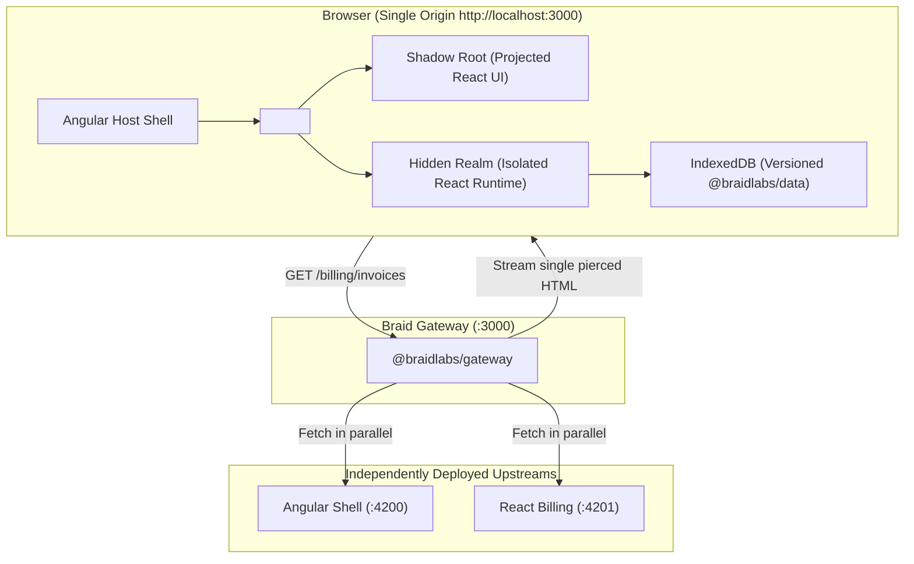

# Progressive Tutorial: Build an Enterprise Microfrontend from Scratch

Welcome to the end-to-end Braid tutorial. In this guide, you will build a complete, production-ready microfrontend system from a blank slate.

> [!TIP]
> **Prefer an interactive sandbox?** You can run and explore the completed tutorial project directly in your browser with zero local setup:
> 
> 

---

## What You Will Build

You will construct **Acme Cloud Portal**, an enterprise application composed of:
1. **Host Shell:** An Angular application providing global navigation, user context, and layout.
2. **Billing Remote:** An independently deployed React application responsible for invoices and checkout.
3. **Braid Gateway:** A single-origin gateway performing parallel streaming, server-side piercing, and exact namespace routing.
4. **Resilient Data Layer:** Local-first IndexedDB persistence with versioned schemas that survive independent deployment rollouts.

---

## Tutorial Roadmap

Follow the progressive steps below:

1. **[Step 1: Monorepo & Two Apps](./01-monorepo-setup.md)**
   Initialize a blank Nx monorepo and create an Angular Host and React Remote running standalone.
2. **[Step 2: Gateway & Manifest](./02-gateway-and-manifest.md)**
   Set up `@braidlabs/gateway` on port 3000, write the fragment manifest, and test parallel SSR piercing.
3. **[Step 3: Mounting & Isolation](./03-mounting-and-isolation.md)**
   Embed the React remote into the Angular shell with `<braid-fragment>`, verifying Shadow DOM encapsulation and realm isolation.
4. **[Step 4: Props, Events & Context Bus](./04-props-and-events.md)**
   Establish decoupled bidirectional communication with typed props and custom events.
5. **[Step 5: Versioned Data & Offline Outbox](./05-versioned-data-skew.md)**
   Layer in `@braidlabs/data` and `@braidlabs/skew` for local-first storage with optimistic updates.
6. **[Step 6: Surviving Schema Evolution](./06-schema-migrations.md)**
   Simulate a rolling deployment where the Remote deploys Schema V2 while the Host runs V1, using `@braidlabs/contract` to migrate seamlessly.
7. **[Step 7: Production Hardening & Service Worker](./07-production-hardening.md)**
   Add `@braidlabs/sw` for chunk caching across deploys, configure fallback UI, and inspect the system using `@braidlabs/console`.

---

Ready to begin? Head over to **[Step 1: Monorepo Setup](./01-monorepo-setup.md)**!
