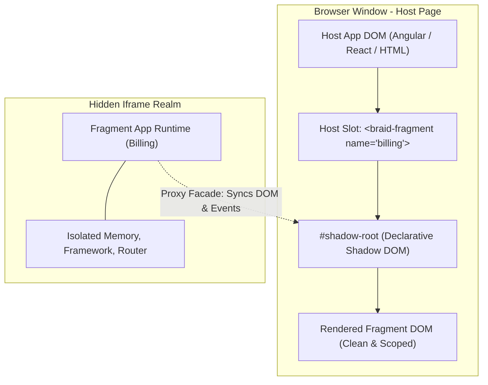
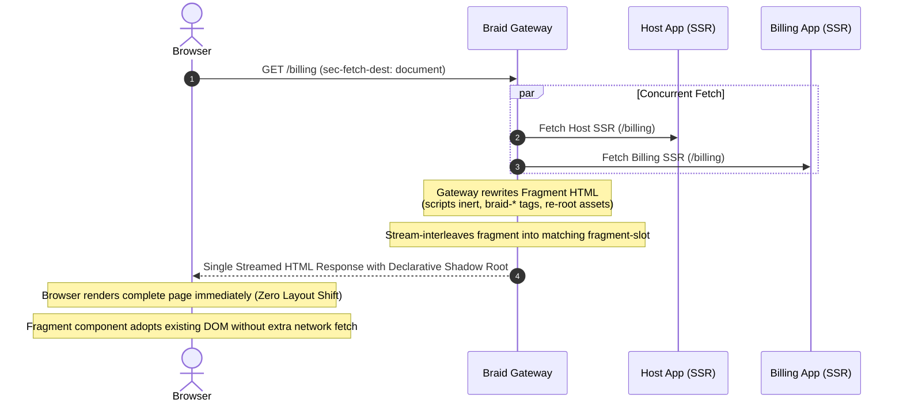

# Tutorial 1 — Compose without colliding: Enterprise Microfrontends with Braid

**Packages:** `@braidlabs/gateway` · `@braidlabs/core` · **Time:** ~30 minutes · **Prerequisites:** Basic understanding of JavaScript/TypeScript, Single-Page Applications (SPAs), and client/server rendering concepts.

---

## Introduction: The Enterprise Growth Wall

When a web application is small, life is simple. You have one repository, one framework (like React or Angular), a single build pipeline, and a small team of engineers. You write components, push to main, and deploy a single bundle to production.

Then the company grows.

Three engineers become thirty. Thirty become three hundred across multiple autonomous squads:
- **Team Checkout** owns the shopping cart and payment flows.
- **Team Catalog** owns product listings and search filters.
- **Team Account** owns user profiles, settings, and billing.

Suddenly, the monolithic frontend application becomes an organizational bottleneck:
1. **Deployment Lockstep (The "Release Train")**: Team Checkout cannot ship a one-line bug fix to payments without waiting for Team Account to finish a half-baked refactor in the same codebase.
2. **Merge Conflicts & Deploy Queues**: A broken test from one team blocks everyone else from deploying. CI/CD test suites take 45 minutes to run.
3. **Framework Lock-in**: If the monolithic app was built in Angular 15, no team can upgrade to Angular 19 or experiment with React without forcing the entire company to coordinate a multi-month rewrite.

To solve this, organizations turn to **Microfrontends (MFEs)**: splitting the massive frontend into smaller, independently developed, independently deployed web applications that compose together into a single unified user experience.

However, how you compose them makes all the difference.

---

## The Prior Solutions & Why They Fall Short

Over the years, the web community has tried three major approaches to microfrontends. Each solved one problem while creating new ones.

```
┌─────────────────────────────────────────────────────────────────────────┐
│ 1. Traditional Iframes                                                  │
│    [Host Shell] ──> <iframe> [Remote Sub-App] </iframe>                 │
│    Pros: Strong memory & script isolation.                              │
│    Cons: Rigid dimensions, clipped modal dialogs, broken browser        │
│          history/deep-linking, auth/cookie partitioning nightmares.     │
├─────────────────────────────────────────────────────────────────────────┤
│ 2. Build-Time Packages (NPM Monorepos)                                  │
│    [Host Shell] ──import──> @company/checkout (NPM package)             │
│    Pros: Clean developer DX, single runtime.                            │
│    Cons: No independent deployability — updating @company/checkout      │
│          still requires rebuilding and redeploying the Host Shell!      │
├─────────────────────────────────────────────────────────────────────────┤
│ 3. Module Federation (Webpack / Rspack / Vite)                          │
│    [Host Shell] ──dynamic import()──> Remote JS Chunks                  │
│    Pros: Seamless UI, dynamic runtime loading.                          │
│    Cons: Single JavaScript context — version collisions, cascading      │
│          crashes, CSS leakage, and notoriously complex SSR.             │
└─────────────────────────────────────────────────────────────────────────┘
```

### The Deep Breakdown: Where Module Federation Breaks Down

Module Federation revolutionized microfrontends by allowing a host application to dynamically import compiled JavaScript modules from remote servers at runtime. 

In controlled environments with identical framework versions, it works well. But in enterprise environments with independent release cycles, it routinely runs into severe hazards:

#### 1. Version Skew & Singleton Collisions
Module Federation loads remote JavaScript directly into the **same window and memory heap** as the host. If the host uses React 18, Remote A needs React 19, and Remote B uses Vue 3, they fight over shared dependencies:
- If you configure React as a *shared singleton*, the bundler chooses one version. If that version has breaking changes or missing APIs, the other remotes crash at runtime with cryptic errors like:
  ```
  TypeError: Cannot read properties of null (reading 'useMemo')
  ```
- If you don't share singletons, multiple copies of libraries run in the same window, breaking libraries that rely on global symbols or `instanceof` checks (e.g. Redux, RxJS, or component libraries).

#### 2. Uncontrolled Blast Radius
Because all code executes in one JavaScript global scope, an unhandled exception or infinite loop in a low-priority widget (e.g. a feedback banner) can crash the entire page, taking down the mission-critical checkout flow with it.

#### 3. Global CSS Pollution
Unless every team adheres perfectly to strict CSS scoping or Shadow DOM, a stylesheet from one remote containing `.btn { padding: 0; }` or a CSS reset will silently mutate the appearance of every other team's buttons across the application.

#### 4. The SSR Nightmare
Server-Side Rendering (SSR) in Module Federation requires coordinated server topologies: the host server must fetch, parse, and execute remote JavaScript chunks in Node.js before rendering. When a remote server lags or fails, the host SSR process often hangs or errors out.

---

## Enter Braid: The Runtime/DOM-Level Approach

**Braid** takes a fundamentally different approach to microfrontends:

> **Instead of composing at the JavaScript Module level, Braid composes at the Runtime/DOM level.**




### The Core Mental Model:
1. **Isolated Execution Realms**: Each microfrontend runs inside its own lightweight, hidden `iframe` realm. It has its own `window`, its own `document`, its own framework instance (any version of React, Angular, Svelte, or vanilla JS), and its own memory heap.
2. **Projected Shadow DOM**: The visual output of the microfrontend is projected into the host page inside a **Shadow Root** (`<template shadowrootmode="open">`).
3. **The Compat Adapter & Document Facade**: The microfrontend doesn't know it's a microfrontend. It thinks it owns the entire page! Braid intercepts its standard DOM APIs (`document.getElementById`, event listeners, router navigations) via a transparent Proxy and connects them seamlessly to its shadow root in the host page.
4. **Server-Side Piercing**: The gateway fetches the shell and fragments concurrently on the server and stitches their server-rendered HTML together in a single streamed response with zero layout shifts.

Let's look at how these pieces work together.

---

## The Core Concepts of Braid

### 1. The Gateway (`@braidlabs/gateway`)

The Braid Gateway is a lightweight, fetch-native middleware that sits at the front of your origin (Express, Fastify, Cloudflare Workers, Node, or Vite in development).

```
Browser Request ──> [ Braid Gateway ] ──┬──> [ Host App Service ]
                                        ├──> [ Billing Fragment Service ]
                                        └──> [ Catalog Fragment Service ]
```

The gateway manages a **Manifest Registry** describing your microfrontends:

```ts
// gateway-config.ts
export const registry = [
  {
    id: 'billing',
    endpoint: 'https://billing.internal',
    pierce: ['/billing', '/billing/*'], // URLs to server-render into the host
    timeoutMs: 1500,
    fallback: 'placeholder',            // graceful degradation if billing fails
  },
  {
    id: 'catalog',
    endpoint: 'https://catalog.internal',
    pierce: ['/products/*'],
  }
];
```

#### The Three Clean Namespaces
The gateway automatically exposes three isolated URL namespaces that cache effortlessly on standard CDNs on URL alone:

| Namespace | What it serves | Purpose |
| :--- | :--- | :--- |
| `/__braid/frag/:id/*` | Assets & API data | Forwards requests directly to the fragment endpoint with the prefix stripped. |
| `/__braid/realm/:id/*` | Realm boot stub | The minimal HTML stub that initializes the hidden iframe runtime. |
| `/__braid/doc/:id/*` | Prepared DOM payload | The fragment's HTML, rewritten and sanitized for injection into the host DOM. |

---

### 2. Piercing: Instant First Paint without Waterfalls

In typical microfrontend setups without server composition, the user experiences a **loading waterfall**:
1. User requests `/billing`.
2. Server sends empty host shell.
3. Browser downloads host JavaScript and renders `<div id="billing-slot">`.
4. Host makes a network fetch to download the Billing remote HTML/JS.
5. Browser downloads Billing assets, boots the app, and finally displays content.
6. Result: **Flash of Blank Content & Cumulative Layout Shift (CLS)**.

#### How Piercing Solves This

When a full page navigation arrives (`sec-fetch-dest: document`), the Braid Gateway intercepts the request:



#### What Happens to Fragment HTML During Piercing?
To ensure the fragment cannot break the host document during SSR:
- `<html>`, `<head>`, and `<body>` are safely converted to `<braid-html>`, `<braid-head>`, and `<braid-body>`.
- `<script>` tags are neutralized into `<script type="inert">` so they do not execute in the host window.
- Asset URLs (images, CSS) are automatically rewritten to route through `/__braid/frag/:id/...`.
- The transformed HTML is injected directly into `<template shadowrootmode="open">` inside the host's `<fragment-slot>`.

---

### 3. The Client Slot (`<braid-fragment>`)

In your host application (Angular, React, or standard HTML), mounting a microfrontend is as simple as adding a declarative custom element:

```html
<!-- Inside your host template (e.g. app.component.html) -->
<header>
  <nav-bar></nav-bar>
</header>

<main>
  <!-- Braid mounts and manages the Billing microfrontend here -->
  <braid-fragment name="billing"></braid-fragment>
</main>
```

#### How the Slot Boots in the Browser:
1. **Adoption**: The `<braid-fragment>` slot checks if the gateway already pierced server-rendered HTML into its shadow root. If yes, it immediately adopts it without making a network request.
2. **Fallback Fetch**: If the page was loaded client-side (SPA navigation), the slot fetches `/__braid/doc/billing/...`.
3. **Realm Boot**: In the background, the slot spawns the hidden iframe realm (`/__braid/realm/billing/...`).
4. **Activation**: The fragment's JavaScript initializes in its realm, connects to the shadow DOM in the host page, and becomes fully interactive.

---

### 4. Zero Code Changes for Sub-Apps: The Compat Adapter

One of the biggest friction points with microfrontends is forcing sub-teams to rewrite their code to match the host's architecture.

With Braid's default **Compat Adapter**:
- A sub-app is built, tested, and run as a **completely normal, standalone web application**.
- Inside its realm, when the sub-app runs:
  ```ts
  // The sub-app writes standard web code:
  document.getElementById('pay-button').addEventListener('click', () => {
    alert('Payment submitted!');
  });
  ```
- Braid's **Document Facade** transparently redirects this query to the corresponding element inside the host's Shadow DOM!
- The sub-app can use whatever framework it wants: React 19, Angular 17, jQuery, or Svelte. It never collides with the host's dependencies.

---

### 5. Routing, State & Context Synchronization

Microfrontends must feel like one cohesive app to the end user. Braid provides built-in mechanisms for coordination without tight coupling:

#### Two-Way Routing Synchronization
When you omit the `src` attribute from `<braid-fragment name="billing">`, the fragment is **bound** to the host:
- When the user clicks a `<a href="/billing/invoices">` inside the billing fragment, it updates the browser's address bar.
- When the user clicks the browser's Back/Forward buttons, the host location drives the fragment's internal router.

#### Context & Props Passing
You can pass reactive properties and environment data across the boundary:

```html
<braid-fragment 
  name="billing" 
  [props]="{ customerId: activeUser.id, theme: 'dark' }">
</braid-fragment>
```

Braid safely passes this data across realms using structured cloning.

---

### 6. Resilience & Blast Radius Containment

What happens when a microfrontend fails?

In Module Federation, an unhandled exception or network timeout in a remote can crash the entire browser window or hang the host server.

In Braid, failure is strictly contained:

```
┌─────────────────────────────────────────────────────────────┐
│ Host Application Page                                       │
│ ┌─────────────────────────┐     ┌─────────────────────────┐ │
│ │  Host Navigation        │     │  User Profile (Healthy) │ │
│ └─────────────────────────┘     └─────────────────────────┘ │
│ ┌─────────────────────────────────────────────────────────┐ │
│ │  <braid-fragment name="billing">                        │ │
│ │  ┌───────────────────────────────────────────────────┐  │ │
│ │  │ [!] Billing service unavailable.                  │  │ │
│ │  │     [ Retry Button ]                              │  │ │
│ │  └───────────────────────────────────────────────────┘  │ │
│ └─────────────────────────────────────────────────────────┘ │
└─────────────────────────────────────────────────────────────┘
```

1. **SSR Timeout Protection**: If the Billing service takes longer than `timeoutMs` (e.g. 1500ms) to respond during server-side rendering, the gateway completes the host page anyway and leaves the slot in placeholder state.
2. **Client-Side Self-Healing**: The browser client automatically attempts to load the fragment client-side. If the backend recovers, the fragment appears without the user ever seeing a broken page.
3. **Runtime Error Boundary**: If the billing JavaScript throws an unhandled error inside its realm, only the hidden iframe and shadow root are affected. The host shell and other fragments remain completely stable.

---

## Step-by-Step Walkthrough: Adding a Braid Fragment

Let's walk through how you would configure and run a Braid microfrontend in practice.

### Step 1: Configure the Gateway Middleware

In your server or edge layer:

```ts
// server.ts
import express from 'express';
import { createGateway } from '@braidlabs/gateway';
import { toNodeMiddleware } from '@braidlabs/gateway/node';

const app = express();

const gateway = createGateway({
  mode: 'production',
  registry: [
    {
      id: 'billing',
      endpoint: 'https://billing.internal.company.com',
      pierce: ['/billing', '/billing/*'],
      timeoutMs: 1200,
      fallback: 'placeholder'
    }
  ]
});

// Mount Braid gateway as the first middleware
app.use(toNodeMiddleware(gateway));

// Host app routes follow (for Angular SSR, enable trustProxyHeaders: true on AngularNodeAppEngine)
app.use(hostAppRouter);

app.listen(3000, () => console.log('Host running on http://localhost:3000'));
```

### Step 2: Add the Fragment Slot in Your Host UI

In your host template (Angular, React, or plain HTML):

```html
<!-- host-shell/src/app/billing-view.component.html -->
<div class="billing-container">
  <h1>Account & Invoicing</h1>
  
  <!-- Braid fragment slot -->
  <braid-fragment 
    name="billing"
    [props]="{ plan: 'enterprise', currency: 'USD' }">
  </braid-fragment>
</div>
```

### Step 3: Serve Your Sub-App Normally

On the Billing team's side, build your application as an independent project:

```sh
# Team Billing's repository
cd apps/billing
npm run build
npm run serve -- --port 4201
```

No special bundler plugins, no shared dependency negotiations, and no webpack configuration tweaks are required.

---

## When to Choose What: Architectural Decision Matrix

| Requirement | Monolith SPA | Module Federation | Braid |
| :--- | :---: | :---: | :---: |
| **Team Size** | 1–2 teams | 2–5 teams | 5+ autonomous squads |
| **Framework Diversity** | Single framework | Must match or align closely | Any framework / legacy apps |
| **Independent Deployments** | ❌ No | ⚠️ Yes (with version discipline) | ✅ Yes (complete isolation) |
| **Dependency Version Skew** | N/A | ❌ Fragile / singleton collisions | ✅ Structurally immune |
| **Fault Isolation (Blast Radius)** | ❌ None | ❌ None (shared JS context) | ✅ Complete (isolated realms) |
| **Server-Side Rendering (SSR)** | ✅ Built-in | ❌ High complexity | ✅ Seamless via Piercing |
| **Payload Size & Overhead** | Lowest | Low | Small overhead (iframe realm) |

---

## Summary & Key Takeaways

1. **Microfrontends are an organizational scaling tool**, enabling autonomous teams to develop, test, and deploy independently without blocking each other.
2. **Module Federation shares a single JavaScript context**, which makes it vulnerable to dependency version conflicts, singleton collisions, global CSS bleeding, and cascading crashes.
3. **Braid isolates at the Realm level and composes at the DOM level**, giving you the visual cohesion of a single app with the security, stability, and independence of separate applications.
4. **Piercing delivers the holy grail of microfrontend performance**: concurrent server-side rendering interleaved into Declarative Shadow DOM with zero client waterfalls, zero layout shifts, and graceful degradation.

---

## Further Reading in This Repository

- [gateway.md](https://github.com/braidjs/braid/blob/main/skills/using-braid/references/gateway.md) — Complete API reference for gateway configuration, manifest schemas, and access control rules.
- [client.md](https://github.com/braidjs/braid/blob/main/skills/using-braid/references/client.md) — Detailed reference for `<braid-fragment>`, lifecycle states, and events.
- [braid-from-module-federation.md](https://github.com/braidjs/braid/blob/main/docs/braid-from-module-federation.md) — Step-by-step guide for migrating an existing Module Federation application to Braid.
- [failure-modes.md](https://github.com/braidjs/braid/blob/main/skills/using-braid/references/failure-modes.md) — Diagnostic guide for debugging realm mismatches, CORS issues, and routing conflicts.
